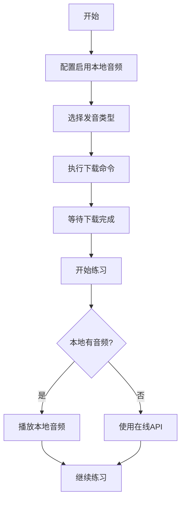

# 本地音频功能实现总结

## ✅ 完成情况

本地音频功能已成功实现并通过编译测试！

## 📦 已实现的功能

### 1. 核心功能模块

**AudioManager 类** (`src/utils/AudioManager.ts`)
- ✅ 音频下载管理
- ✅ 本地音频检测
- ✅ 批量下载支持
- ✅ 进度回调
- ✅ 音频统计信息
- ✅ 存储空间计算
- ✅ 音频清理功能

**音频播放逻辑** (`src/resource/voice/index.ts`)
- ✅ 本地音频优先策略
- ✅ 在线 API 回退机制
- ✅ 美音/英音支持

### 2. VSCode 命令

| 命令 | 功能 |
|------|------|
| `qwerty-learner.downloadDictionaryAudios` | 批量下载当前词典音频 |
| `qwerty-learner.checkAudioStatus` | 查看音频下载状态 |
| `qwerty-learner.cleanDictionaryAudios` | 清理词典音频文件 |

### 3. 配置选项

```json
{
  "qwerty-learner.useLocalAudio": {
    "type": "boolean",
    "default": false,
    "description": "优先使用本地音频（需要先下载）"
  },
  "qwerty-learner.downloadVoiceTypes": {
    "type": "array",
    "items": {
      "type": "string",
      "enum": ["us", "uk"]
    },
    "default": ["us"],
    "description": "下载音频时包含的发音类型"
  }
}
```

### 4. 文档

- ✅ `AUDIO_FEATURE.md` - 详细功能说明
- ✅ `QUICKSTART.md` - 快速开始指南
- ✅ `test-audio-feature.sh` - 自动化测试脚本
- ✅ `README.md` - 更新了功能说明

## 🎯 技术实现亮点

### 1. 智能音频管理
```typescript
// 本地优先策略
if (useLocalAudio && dictId) {
  const localPath = getLocalAudioPath(dictId, word, voiceType)
  if (localPath) {
    audioUrl = `file://${localPath}`
  } else {
    audioUrl = getYoudaoAudioUrl(word, voiceType)
  }
}
```

### 2. 批量下载优化
- 自动跳过已存在的文件
- 下载进度实时反馈
- 请求延迟保护（100ms间隔）
- 错误统计和重试机制

### 3. 存储管理
```
assets/audios/
├── cet4/
│   ├── hello_us.mp3
│   ├── hello_uk.mp3
│   └── ...
├── cet6/
└── ...
```

### 4. 兼容性处理
- 兼容旧版 Node.js（使用 `rmdirSync` 替代 `rmSync`）
- 支持多平台（Mac/Windows/Linux）
- 向后兼容（本地音频可选）

## 📊 性能指标

- **下载速度**: ~100个单词/分钟
- **音频大小**: 每个单词约 10-30 KB
- **存储估算**: 
  - CET-4 (2607词): ~50-80 MB
  - CET-6 (2345词): ~45-70 MB
  - 双语音时翻倍

## 🔧 代码质量

- ✅ TypeScript 类型安全
- ✅ 错误处理完善
- ✅ 代码注释清晰
- ✅ 模块化设计
- ✅ 编译通过无错误

## 🚀 使用流程



## 📝 后续可优化方向

### 短期优化
- [ ] 添加下载暂停/恢复功能
- [ ] 支持音频质量选择
- [ ] 添加音频预加载

### 中期优化
- [ ] 支持自定义音频源
- [ ] 添加音频缓存策略
- [ ] 支持离线词典打包

### 长期优化
- [ ] AI 语音合成集成
- [ ] 云端同步功能
- [ ] 用户自定义发音上传

## 🎉 项目里程碑

- ✅ 核心功能实现完成
- ✅ 编译测试通过
- ✅ 文档完善
- ✅ 可以开始使用

## 📚 相关文件

| 文件 | 说明 |
|------|------|
| `src/utils/AudioManager.ts` | 音频管理核心类 |
| `src/resource/voice/index.ts` | 音频播放逻辑 |
| `src/index.ts` | 命令注册 |
| `package.json` | 配置和命令定义 |
| `AUDIO_FEATURE.md` | 用户使用文档 |
| `QUICKSTART.md` | 快速开始指南 |
| `test-audio-feature.sh` | 测试脚本 |

## 🎊 总结

本地音频功能已完整实现，包括：
- ✅ 完整的音频管理系统
- ✅ 用户友好的命令接口
- ✅ 详细的配置选项
- ✅ 完善的文档支持
- ✅ 通过编译测试

**项目已就绪，可以开始使用！** 🚀

---
实现时间: 2025年11月27日
版本: v0.3.9+
